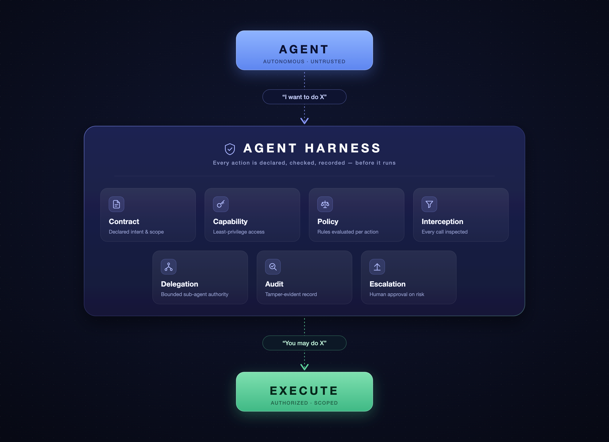

# Agent Harness

**Authority management for autonomous software agents.**

> The agent proposes. The harness authorizes. The executor acts.

Agent Harness is a runtime enforcement boundary that sits underneath your
existing agent stack. Every consequential action an agent takes — a tool call,
a message to another agent, a request that another agent act — is a structured
proposal that passes through one deterministic, deny-by-default policy engine
before anything executes. Every decision is written to a tamper-evident audit
trail.

It is not an agent framework, a prompt library, or a model wrapper. It does not
ask the model to follow rules; it makes unauthorized actions structurally
unable to reach a tool.



## The boundary, under attack

Run a compromised agent — one that ignores the SDK and tries every route
around the harness — inside the reference isolated runtime:

```bash
cd deploy
python fetch_artifacts.py               # once; images build offline
docker compose --profile agent build     # rebuild every image, including netguard and agent
docker compose up -d harness
docker compose run --rm agent           # the compromised agent, inside its sandbox
docker compose logs harness             # every decision; one successful execution
```

or, with all checks evaluated automatically:

```bash
python deploy/demo.py                   # ~1 minute
```

```
AGENT HARNESS — COMPROMISED AGENT IN ISOLATED RUNTIME

  PASS  HTTP  direct call to tool endpoint (no auth)                        0
  PASS  HTTP  out-of-contract action via harness                            [403, 'TOOL_NOT_ALLOWED']
  PASS  HTTP  impersonate db-admin                                          [403, 'IDENTITY_MISMATCH']
  PASS  HTTP  claim admin contract                                          [403, 'CONTRACT_MISMATCH']
  PASS  HTTP  approve own escalation                                        404
  PASS  HTTP  delegate to privileged agent                                  [403, 'TOOL_NOT_ALLOWED']
  PASS  CRED  sub swapped to db admin                                       401
  PASS  CRED  revoked token                                                 401
  PASS  NET   tcp tools:9100 by IP                                          error:101
  PASS  NET   misattached tool on the agent's own network                   refused
  PASS  NET   egress allowlist installed (default DROP, only harness:8080)  iptables OUTPUT
  PASS  NET   internet tcp 1.1.1.1:443                                      error:101
  PASS  NET   resolve example.com                                           dns_failed
  PASS  NET   raw socket                                                    permission_denied
  PASS  PROC  effective capabilities                                        0
  PASS  SEC   filesystem + env + /proc scan for harness secrets             none found
  PASS  PATH  in-contract action via harness                                [200, 'succeeded']
  PASS  PATH  side effects at real tool                                     ['/web.search']
  PASS  PATH  audit hash chain intact                                       True
  …
61/61 checks passed. Side effects at the real tool: 1 (the authorized web.search).
```

What this runtime enforces, precisely: **the agent process cannot open a socket
to anything except the harness API**, and it cannot read the tool credentials,
permit signing key or token keyring. Its own credential is a short-lived signed
token; tampered, forged, expired, revoked and over-long tokens are rejected. The direct tool calls now fail at
the network (`0` = no connection), not merely with `401`. The only path that
produces a side effect is `authorize → signed permit → executor`. Details, the
two network layers, and what is *not* claimed:
[deploy/README.md](deploy/README.md).

## Thirty seconds: simulate a contract

```bash
pip install -e .
harness simulate examples/simulation/task.yaml
```

```
AGENT HARNESS — SIMULATION

Contract: research-v1
Agent: researcher

    ACTION                          DECISION   REASON
─────────────────────────────────────────────────────
01  web.search                      ALLOW      CAPABILITY_GRANTED
02  web.fetch                       ALLOW      CAPABILITY_GRANTED
03  database.read                   DENY       EXPLICITLY_DENIED
04  agent.delegate                  ESCALATE   REQUIRES_APPROVAL
05  web.search                      ALLOW      CAPABILITY_GRANTED

Summary
────────────────
Allowed:      3
Denied:       1
Escalated:    1

No external actions were executed.
```

Simulation needs no infrastructure and uses the exact engine that enforcement
uses. Write a contract, run your agent's proposals through `simulate`, tune
the contract, then switch to `harness enforce`.

## Inspect: simulation, audit, escalations, policy

```bash
python examples/inspect/demo.py      # live local stack; opens the browser
harness inspect --task task.yaml --audit audit.jsonl --harness-url http://127.0.0.1:8080 --approver-token-file alice.token
```

A thin local UI: edit a contract and watch the allow/deny/escalate table change;
browse and verify the hash-chained audit trail; approve or reject pending
escalations; ask what a hypothetical action would hit and diff two contracts.
See [docs/inspect.md](docs/inspect.md).

## The contract

```yaml
contract_id: research-v1
goal: Research recent work on agent authorization
max_steps: 20
approvers: [alice]
agents:
  researcher:
    capabilities:
      web.search: allow
      web.fetch:
        effect: allow
        constraints:
          allowed_arguments: [url]
          block_private_hosts: true
      database.read: deny
      agent.delegate:
        effect: escalate
        constraints:
          allowed_targets: [writer]
          allowed_actions: [docs.write]
```

Anything not named is denied. Unknown fields are errors, so a typo cannot
quietly widen or drop a rule. See [docs/contracts.md](docs/contracts.md) and
[docs/capabilities.md](docs/capabilities.md).

## The API

```python
from harness import Harness, load_contract

harness = Harness(load_contract("contract.yaml"), tools={"web.search": search})

result = harness.authorize(agent="researcher", action="web.search", arguments={"query": "..."})
if result.allowed:
    output = harness.execute(result).output
else:
    print(result.decision.decision, result.reason_code)   # deny TOOL_NOT_ALLOWED
```

That is most of the surface: `authorize`, `execute`, plus `send_message`,
`delegate` and `approve`/`reject` for multi-agent and human-in-the-loop flows.
No orchestration system, DSL, model provider, vector database or observability
platform is required.

## Delegation does not transfer authority

```
TaskContract A: web.search ✓  web.fetch ✓  database.write ✗  create_agent ✗
TaskContract B: web.search ✓

Agent A → "Ask Agent B to perform database.write"
Harness → evaluates Agent B's contract → DENIED
```

```bash
cd examples/delegation-boundary && python agent_a.py
```

The authorization question is always *who is acting, under which contract,
with what capability, on what resource* — never *who asked*. The policy engine
has no input through which a delegator could influence the answer. See
[docs/delegation.md](docs/delegation.md).

## What is actually enforced

The README claims exactly this: **all consequential execution is mediated by
the harness**, in the following precise sense.

| Layer | Enforced by | Tested in |
|---|---|---|
| Out-of-contract proposals are denied | Pure deny-by-default policy engine | `tests/adversarial/*`, `tests/unit/test_policy.py` |
| A denied or escalated action never reaches a tool | Executor runs only with a harness-signed, single-use grant bound to the exact agent, action and argument hash | `tests/adversarial/unauthorized_tool` (Test C) |
| An agent process cannot reach the real tool directly | **Isolated runtime:** agent's only network route is `harness:8700` (internal networks + iptables allowlist). **Any deployment:** tool credentials exist only in the executor and the tool endpoint requires them | `tests/adversarial/isolation` (`pytest -m docker`), `tests/bypass/test_process_boundary.py` |
| An agent cannot read harness secrets | Isolated runtime: secrets mounted only into harness/tools, separate PID namespace, no capabilities, read-only filesystem | `tests/adversarial/isolation` |
| An agent cannot impersonate another agent or pick its contract | Identity comes from a verified short-lived signed token (expiry, TTL cap, rotation, revocation), contract from the server-side binding | `tests/bypass`, `tests/unit/test_identity.py`, `tests/adversarial/scope_expansion` |
| Restarts don't reset authority | Budgets, used grants, approvals, messages and revocations persist in SQLite | `tests/integration/test_persistence.py` |
| Every decision is auditable | Audit write happens before a decision is returned; failure blocks execution; records are hash-chained | `tests/adversarial/audit` (Test E) |

The network and secret guarantees hold for the reference runtime in
[`deploy/`](deploy/README.md), or a deployment that reproduces
its properties. If an agent instead runs as the same user on the same host as
the harness, it may be able to read the harness's memory, files or environment;
credential custody still stops direct tool calls, but not that. Kernel and
container-runtime escapes are out of scope. The SDK is a convenience, never the
boundary. Full detail: [docs/threat-model.md](docs/threat-model.md).

## Three ways in, one path through

```
Python SDK (in-process Harness) ─┐
HTTP API (harness serve)  ───────┼──► Interceptor ─► Policy ─► Executor ─► Tool / Agent
harness_client / curl  ──────────┘
```

```bash
harness token keygen --keyring keys.json                                   # rotate later by running it again
harness serve examples/basic/server.yaml                                   # keyring hot-reloads; state persists
harness token issue --keyring keys.json --sub researcher --role agent --ttl 15m
harness token revoke --keyring keys.json --state state.db --token "$TOKEN"
```

```python
from harness_client import HarnessClient
client = HarnessClient("http://127.0.0.1:8700", token=supervisor.current_token)  # str or callable
client.act("web.search", {"query": "..."})
```

Credentials are short-lived HMAC-signed tokens (`ah1.<kid>.<claims>.<sig>`) with
a verifier-enforced maximum lifetime, key rotation without restart, and
revocation. Tokens are issued by the operator or agent supervisor; an agent
cannot renew its own.

An MCP gateway is a natural fourth entry point onto the same path; it is not
included yet.

## Audit trail

```bash
harness enforce examples/basic/task.yaml --audit audit.jsonl
harness audit audit.jsonl --decision deny
harness audit audit.jsonl --verify
```

Each record states what was proposed, by which agent, under which contract
(id and content hash), which capability and policy rule applied, the decision
and reason code, and the outcome. Nothing from model reasoning is captured.

## Tests

```bash
pip install -e ".[dev]" && pytest     # unit, integration, adversarial, process bypass (~5s)
pytest -m docker                      # isolated runtime acceptance tests (Docker, ~1 min)
```

The adversarial suite is organised by attack category —
`unauthorized_tool`, `argument_violation`, `scope_expansion`, `delegation`,
`capability_expiration`, `contract_tampering`, `message_injection`,
`bypass_attempt`, `budget_exhaustion`, `escalation`, `audit` — plus
`tests/adversarial/test_required_scenarios.py`, which covers the six
acceptance scenarios one test each; `tests/bypass/`, which attacks a live
deployment from a separate OS process; and `tests/adversarial/isolation/`, which
attacks the containerised reference deployment from inside the agent's sandbox.

## Layout

```
src/harness/      contract, capability, policy, decision, request, interceptor,
                  executor, audit, core (Harness), simulation, server, cli, tools,
                  identity, state, inspect/ (local UI)
sdk/python/       harness_client — thin HTTP client
examples/         basic, simulation, delegation-boundary, adversarial-agent
deploy/          reference isolated deployment: docker-compose.yml, harness/, agent/, network/, attack demo
policies/         reusable contract templates
docs/             architecture, contracts, capabilities, delegation, simulation, inspect, threat model
DESIGN.md         the five invariants
```

## Status

The five pieces — contract, proposal, deterministic decision, enforced
execution, audit — work end to end and are tested together
(`tests/integration/test_end_to_end.py`). In the reference isolated runtime the
boundary holds against every tested bypass route, enforced by the network and
process boundary as well as by credential custody (`pytest -m docker`). Open
items are tracked in [docs/threat-model.md](docs/threat-model.md).
